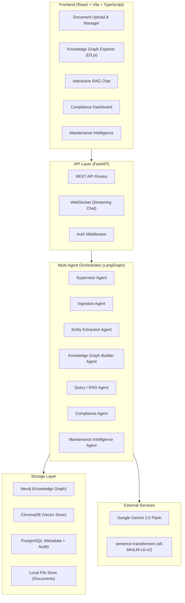
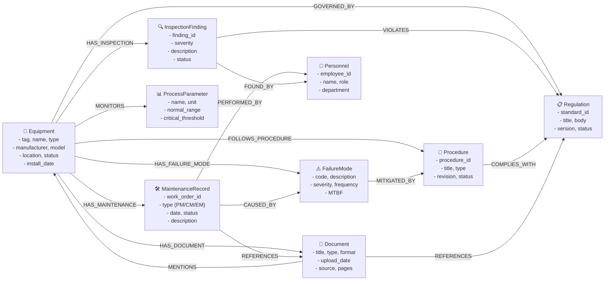
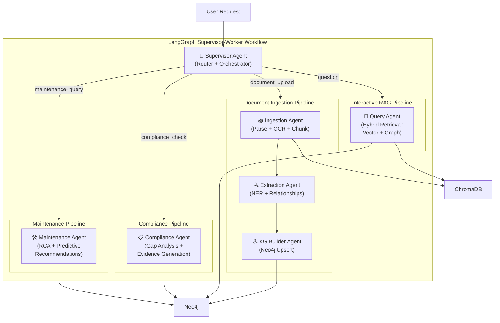

# IntelliPlant — AI-Powered Industrial Knowledge Intelligence Platform

## Problem Statement 8: Unified Asset & Operations Brain

> Build an AI-powered Industrial Knowledge Intelligence platform that ingests heterogeneous documents — engineering drawings, maintenance records, safety procedures, inspection reports, operating instructions, project files — across structured and unstructured formats, and makes their collective intelligence queryable, actionable, and continuously updated at the point of need.

---

## System Architecture Overview



---

## Technology Stack

| Layer | Technology | Version | Rationale |
|---|---|---|---|
| **Backend Framework** | FastAPI | 0.115+ | Async-native, auto-docs, WebSocket support, Pydantic v2 validation |
| **Frontend Framework** | React + Vite | React 19, Vite 6 | Fast HMR, TypeScript-first, modern tooling |
| **Knowledge Graph** | Neo4j Community | 5.x | Industry-standard graph DB, free, Cypher query language, LangChain integration |
| **Vector Store** | ChromaDB | 0.6+ | Lightweight, embedded, no server needed for hackathon, persistent storage |
| **Metadata DB** | SQLite (via SQLAlchemy) | — | Zero-config for hackathon. Production → PostgreSQL |
| **Multi-Agent Framework** | LangGraph | 0.3+ | Stateful graph workflows, supervisor-worker pattern, checkpointing |
| **RAG Framework** | LangChain + langchain-neo4j | 0.3+ | GraphRAG, hybrid retrieval, Neo4jVector, GraphCypherQAChain |
| **LLM** | Google Gemini 2.0 Flash | — | Fast, cheap, 1M context, structured output. Free tier = 15 RPM |
| **Embeddings** | sentence-transformers (all-MiniLM-L6-v2) | — | Local, free, fast, 384-dim. No API dependency. |
| **Document Processing** | PyMuPDF + Unstructured | — | PDF/image/docx parsing, OCR via Tesseract |
| **OCR** | Tesseract | 5.x | Open-source, proven, Windows binary available |
| **Entity Extraction** | SpaCy + GLiNER | — | SpaCy for base NER, GLiNER for zero-shot industrial entity extraction |
| **Graph Visualization** | react-force-graph-3d + D3.js | — | Interactive 3D knowledge graph, stunning visual |
| **Task Queue** | Background Tasks (FastAPI) | — | Sufficient for hackathon. Production → Celery + Redis |
| **Containerization** | Docker + Docker Compose | — | One-command setup for all services |

---

## Project Directory Structure

```
d:\ET\IntelliPlant\
├── README.md
├── .env.example
├── .env                          # Local (gitignored)
├── .gitignore
├── docker-compose.yml
├── Makefile                      # Common commands
│
├── backend/
│   ├── requirements.txt
│   ├── main.py                   # FastAPI entry point
│   ├── config/
│   │   ├── __init__.py
│   │   └── settings.py           # Pydantic Settings (env vars)
│   │
│   ├── api/
│   │   ├── __init__.py
│   │   └── routes/
│   │       ├── __init__.py
│   │       ├── documents.py      # Upload, list, delete documents
│   │       ├── knowledge_graph.py # KG stats, nodes, relationships, search
│   │       ├── chat.py           # Interactive RAG (WebSocket + REST)
│   │       ├── compliance.py     # Compliance gap analysis
│   │       ├── maintenance.py    # Maintenance intelligence queries
│   │       └── health.py         # Health check endpoint
│   │
│   ├── schemas/
│   │   ├── __init__.py
│   │   ├── document.py           # Pydantic models for document API
│   │   ├── chat.py               # Chat request/response models
│   │   ├── knowledge_graph.py    # KG query/response models
│   │   └── compliance.py         # Compliance report models
│   │
│   ├── services/
│   │   ├── __init__.py
│   │   ├── document_processor.py # PDF/DOCX/image parsing + OCR
│   │   ├── entity_extractor.py   # NER + industrial entity extraction
│   │   ├── knowledge_graph_service.py  # Neo4j CRUD + Cypher queries
│   │   ├── vector_store_service.py     # ChromaDB operations
│   │   ├── rag_engine.py         # Hybrid retrieval (vector + graph)
│   │   └── llm_service.py        # Gemini API wrapper
│   │
│   ├── agents/
│   │   ├── __init__.py
│   │   ├── orchestrator.py       # LangGraph supervisor workflow
│   │   ├── ingestion_agent.py    # Document ingestion + chunking
│   │   ├── extraction_agent.py   # Entity + relationship extraction
│   │   ├── kg_builder_agent.py   # Knowledge graph construction
│   │   ├── query_agent.py        # Interactive RAG agent
│   │   ├── compliance_agent.py   # Regulatory compliance checking
│   │   ├── maintenance_agent.py  # Maintenance intelligence + RCA
│   │   └── state.py              # Shared agent state definitions
│   │
│   ├── models/
│   │   ├── __init__.py
│   │   └── database.py           # SQLAlchemy models (document metadata, audit log)
│   │
│   ├── database/
│   │   ├── __init__.py
│   │   ├── neo4j_client.py       # Neo4j connection + helper methods
│   │   ├── chroma_client.py      # ChromaDB initialization
│   │   └── sqlite_client.py      # SQLAlchemy session factory
│   │
│   ├── utils/
│   │   ├── __init__.py
│   │   ├── text_splitter.py      # Industrial-aware text chunking
│   │   └── prompts.py            # All LLM prompt templates
│   │
│   └── tests/
│       ├── __init__.py
│       ├── test_document_processor.py
│       ├── test_entity_extractor.py
│       ├── test_rag_engine.py
│       └── test_api.py
│
├── frontend/
│   ├── package.json
│   ├── vite.config.ts
│   ├── tsconfig.json
│   ├── index.html
│   └── src/
│       ├── main.tsx
│       ├── App.tsx
│       ├── index.css              # Global design system
│       ├── router/
│       │   └── index.tsx          # React Router configuration
│       ├── components/
│       │   ├── layout/
│       │   │   ├── Sidebar.tsx
│       │   │   ├── Header.tsx
│       │   │   └── MainLayout.tsx
│       │   ├── common/
│       │   │   ├── Button.tsx
│       │   │   ├── Card.tsx
│       │   │   ├── Modal.tsx
│       │   │   ├── LoadingSpinner.tsx
│       │   │   └── Badge.tsx
│       │   ├── documents/
│       │   │   ├── DocumentUpload.tsx    # Drag-drop upload with progress
│       │   │   ├── DocumentList.tsx      # Document library with filters
│       │   │   └── DocumentViewer.tsx    # Preview document content
│       │   ├── knowledge-graph/
│       │   │   ├── GraphViewer3D.tsx     # 3D force-directed graph
│       │   │   ├── GraphControls.tsx     # Filter/search controls
│       │   │   ├── NodeDetail.tsx        # Node click detail panel
│       │   │   └── GraphStats.tsx        # Entity/relationship counts
│       │   ├── chat/
│       │   │   ├── ChatInterface.tsx     # Main chat UI
│       │   │   ├── ChatMessage.tsx       # Individual message bubble
│       │   │   ├── SourceCitation.tsx    # Clickable source references
│       │   │   └── ConfidenceIndicator.tsx
│       │   ├── compliance/
│       │   │   ├── ComplianceDashboard.tsx
│       │   │   ├── GapAnalysisCard.tsx
│       │   │   └── ComplianceReport.tsx
│       │   └── maintenance/
│       │       ├── MaintenanceDashboard.tsx
│       │       ├── RCAAnalysis.tsx
│       │       └── MaintenanceTimeline.tsx
│       ├── hooks/
│       │   ├── useDocuments.ts
│       │   ├── useChat.ts           # WebSocket chat hook
│       │   ├── useKnowledgeGraph.ts
│       │   └── useCompliance.ts
│       ├── services/
│       │   └── api.ts               # Axios client + API functions
│       ├── types/
│       │   └── index.ts             # TypeScript interfaces
│       └── utils/
│           └── formatters.ts
│
├── data/
│   ├── sample_documents/            # Pre-loaded demo documents
│   │   ├── equipment_manuals/       # Pump, compressor, valve manuals
│   │   ├── maintenance_records/     # Synthetic work orders
│   │   ├── inspection_reports/      # Synthetic inspection findings
│   │   ├── safety_procedures/       # SOPs, PTW procedures
│   │   └── regulatory/             # OISD standards, Factory Act excerpts
│   └── seed/
│       └── seed_knowledge_graph.py  # Pre-populate KG with sample data
│
├── scripts/
│   ├── setup_windows.ps1            # Windows setup script
│   ├── setup_linux.sh               # Linux setup script
│   ├── download_datasets.py         # Automated dataset downloader
│   └── generate_synthetic_data.py   # Generate realistic maintenance records
│
└── docs/
    ├── architecture_diagram.png
    └── api_reference.md
```

---

## Dataset Acquisition Strategy

> [!IMPORTANT]
> All datasets listed below are **freely available** and **legal to use**. No proprietary data is required.

### 1. Equipment Manuals & Datasheets (REAL documents)

| Source | What You Get | URL / Method |
|---|---|---|
| **Siemens Industrial** | Pump, motor, compressor manuals (PDF) | [siemens.com/industrial-products](https://www.siemens.com) → Product Documentation |
| **ABB Library** | Motor, drive, transformer documentation | [library.abb.com](https://library.abb.com) → free download |
| **Honeywell Process** | DCS/SCADA manuals, safety system docs | [process.honeywell.com](https://process.honeywell.com) → Technical Documents |
| **Grundfos Product Center** | Detailed pump datasheets, installation guides | [product-selection.grundfos.com](https://product-selection.grundfos.com) |
| **Emerson** | Valve, actuator, transmitter manuals | [emerson.com](https://www.emerson.com) → Documents & Drawings |

**Action**: Download 15-20 equipment manuals (PDFs, 5-50 pages each) covering pumps, compressors, valves, motors, and safety systems.

### 2. Regulatory & Safety Standards (REAL documents)

| Source | What You Get | Access |
|---|---|---|
| **OISD Standards** | Oil industry safety standards (work permits, fire protection, layouts) | [oisd.gov.in](https://www.oisd.gov.in) → Register for free download |
| **Factory Act 1948** | Full text of the Indian Factories Act | [indiacode.nic.in](https://www.indiacode.nic.in) → Free public law |
| **PESO Guidelines** | Petroleum & explosives safety | [peso.gov.in](https://peso.gov.in) → Free download |
| **BIS Standards** | Indian standards for industrial equipment | [bis.gov.in](https://www.bis.gov.in) → Selected standards free |
| **OSHA Technical Manuals** | International safety reference (supplement Indian docs) | [osha.gov](https://www.osha.gov/otm) → Free |

**Action**: Download 10-15 regulatory documents. These are the backbone of the compliance agent.

### 3. Maintenance Records & Work Orders (SYNTHETIC but realistic)

We'll generate these using a Python script that creates realistic CMMS-style records:

```python
# scripts/generate_synthetic_data.py will create:
# - 500+ work orders (equipment tag, failure mode, action taken, date, personnel)
# - 200+ inspection reports (equipment, findings, severity, recommendations)
# - 100+ incident/near-miss reports
# - 50+ SOP documents
# Based on real industrial formats (SAP PM, Maximo templates)
```

### 4. P&ID Drawings (ACADEMIC datasets)

| Source | What You Get | URL |
|---|---|---|
| **Zenodo PID_dataset** | P&ID images from industry + web scraping | [zenodo.org/records/4588402](https://zenodo.org/records/4588402) |
| **Digitize-PID** | 500 synthetic annotated P&IDs | [arxiv.org/abs/2109.03794](https://arxiv.org/abs/2109.03794) |

### 5. Predictive Maintenance Sensor Data (PUBLIC datasets)

| Source | What You Get | URL |
|---|---|---|
| **NASA C-MAPSS** | Turbofan engine degradation simulation | [NASA Prognostics Repository](https://www.nasa.gov/intelligent-systems-division/discovery-and-systems-health/pcoe/pcoe-data-set-repository/) |
| **AI4I 2020** | Predictive maintenance dataset (10K records) | [UCI ML Repository](https://archive.ics.uci.edu/dataset/601/ai4i+2020+predictive+maintenance+dataset) |

---

## Knowledge Graph Schema (Neo4j)



**Node Types**: 9 | **Relationship Types**: 15 | **Target Graph Size**: 50,000+ entities for demo

---

## Multi-Agent Architecture (LangGraph)



### Agent Details

#### 1. Supervisor Agent (Router)
- Receives all user requests
- Classifies intent: `document_upload`, `question`, `compliance_check`, `maintenance_query`
- Routes to appropriate sub-pipeline
- Aggregates responses, manages state

#### 2. Ingestion Agent
- Parses uploaded documents (PDF, DOCX, images, spreadsheets)
- Applies OCR for scanned documents (Tesseract)
- Chunks text using industrial-aware splitter (preserves equipment tags, table structures)
- Stores chunks in ChromaDB with metadata

#### 3. Extraction Agent
- Extracts named entities: equipment tags (e.g., `P-101A`), process parameters, personnel names, dates, regulatory references
- Uses SpaCy + GLiNER for zero-shot industrial NER
- Identifies relationships between entities using LLM-based extraction
- Outputs structured entity-relationship triples

#### 4. Knowledge Graph Builder Agent
- Takes entity-relationship triples from Extraction Agent
- Resolves entity duplicates (fuzzy matching on equipment tags)
- Upserts nodes and relationships into Neo4j
- Maintains provenance (which document each entity came from)

#### 5. Query Agent (Interactive RAG)
- **Hybrid retrieval**: Vector similarity search (ChromaDB) + Knowledge Graph traversal (Neo4j Cypher)
- **GraphRAG**: Uses Neo4jVector for semantic search, GraphCypherQAChain for structured queries
- Returns answers with: source citations, confidence scores, direct document links
- Supports follow-up questions with conversation memory

#### 6. Compliance Agent
- Maps regulatory requirements against current procedures and equipment states
- Identifies compliance gaps by traversing `GOVERNED_BY` and `COMPLIES_WITH` relationships
- Generates compliance evidence packages with document references
- Flags deviations with severity ratings

#### 7. Maintenance Intelligence Agent
- Analyses work order history and failure patterns across equipment
- Performs Root Cause Analysis by correlating failure modes, maintenance actions, and operating conditions
- Generates predictive maintenance recommendations
- Creates optimized maintenance schedules based on MTBF data

---

## Proposed Changes — File-by-File Breakdown

### Backend Foundation

---

#### [NEW] [requirements.txt](file:///d:/ET/IntelliPlant/backend/requirements.txt)
```
# Core
fastapi==0.115.12
uvicorn[standard]==0.34.3
python-dotenv==1.1.1
pydantic==2.11.3
pydantic-settings==2.9.1

# Database
sqlalchemy==2.0.41
aiosqlite==0.21.0

# Neo4j
neo4j==5.28.1
langchain-neo4j==0.4.2

# Vector Store
chromadb==0.6.3

# LangChain + LangGraph
langchain==0.3.25
langchain-core==0.3.59
langchain-google-genai==2.1.5
langchain-community==0.3.24
langgraph==0.4.8

# Document Processing
pymupdf==1.27.2.3
python-docx==1.1.2
unstructured==0.17.5
openpyxl==3.1.5

# OCR
pytesseract==0.3.13

# NLP / Entity Extraction
spacy==3.8.7
gliner==0.2.18

# Embeddings
sentence-transformers==4.1.0

# API utilities
python-multipart==0.0.20
websockets==15.0.1
aiofiles==24.1.0

# Testing
pytest==8.3.5
httpx==0.28.1
```

---

#### [NEW] [.env.example](file:///d:/ET/IntelliPlant/.env.example)
```
# LLM
GOOGLE_API_KEY=your_gemini_api_key_here

# Neo4j
NEO4J_URI=bolt://localhost:7687
NEO4J_USER=neo4j
NEO4J_PASSWORD=intelliplant2026

# Application
APP_NAME=IntelliPlant
APP_ENV=development
DEBUG=true
CORS_ORIGINS=http://localhost:5173

# Storage
UPLOAD_DIR=./uploads
CHROMA_PERSIST_DIR=./chroma_db
SQLITE_URL=sqlite+aiosqlite:///./intelliplant.db
```

---

#### [NEW] [docker-compose.yml](file:///d:/ET/IntelliPlant/docker-compose.yml)
Runs Neo4j with APOC plugin pre-configured. Backend and frontend can run natively or in containers.

---

#### [NEW] [main.py](file:///d:/ET/IntelliPlant/backend/main.py)
FastAPI application with:
- CORS middleware (allow frontend origin)
- Lifespan handler (initialize Neo4j, ChromaDB, load SpaCy model on startup; cleanup on shutdown)
- Route registration for all API modules
- WebSocket endpoint for streaming chat
- Static file serving for uploaded documents

---

#### [NEW] [config/settings.py](file:///d:/ET/IntelliPlant/backend/config/settings.py)
Pydantic Settings class loading from `.env`:
- All database connection strings
- API keys
- Upload directory paths
- Model configuration (embedding model name, LLM model name)

---

#### [NEW] [api/routes/documents.py](file:///d:/ET/IntelliPlant/backend/api/routes/documents.py)
- `POST /api/documents/upload` — Upload single/multiple files, triggers ingestion pipeline
- `GET /api/documents` — List all uploaded documents with metadata
- `GET /api/documents/{id}` — Get document details + extracted entities
- `DELETE /api/documents/{id}` — Remove document and associated KG nodes
- `GET /api/documents/{id}/entities` — Get entities extracted from this document
- `POST /api/documents/batch-upload` — Upload entire directory

---

#### [NEW] [api/routes/chat.py](file:///d:/ET/IntelliPlant/backend/api/routes/chat.py)
- `POST /api/chat` — Send a query, get RAG response with citations
- `WebSocket /api/chat/ws` — Streaming chat with real-time token delivery
- `GET /api/chat/history` — Get conversation history
- `POST /api/chat/feedback` — Rate response quality (for evaluation)

---

#### [NEW] [api/routes/knowledge_graph.py](file:///d:/ET/IntelliPlant/backend/api/routes/knowledge_graph.py)
- `GET /api/kg/stats` — Node/relationship counts by type
- `GET /api/kg/nodes` — Paginated node listing with filters
- `GET /api/kg/nodes/{id}` — Node detail with all relationships
- `GET /api/kg/search` — Full-text search across KG
- `GET /api/kg/subgraph` — Get N-hop subgraph around a node (for visualization)
- `POST /api/kg/cypher` — Execute raw Cypher query (admin only)

---

#### [NEW] [api/routes/compliance.py](file:///d:/ET/IntelliPlant/backend/api/routes/compliance.py)
- `POST /api/compliance/analyze` — Run compliance gap analysis against specified regulation
- `GET /api/compliance/gaps` — List all identified compliance gaps
- `GET /api/compliance/report` — Generate downloadable compliance evidence report
- `GET /api/compliance/regulations` — List all regulatory standards in KG

---

#### [NEW] [api/routes/maintenance.py](file:///d:/ET/IntelliPlant/backend/api/routes/maintenance.py)
- `POST /api/maintenance/rca` — Root cause analysis for specified equipment/failure
- `GET /api/maintenance/recommendations` — Get predictive maintenance recommendations
- `GET /api/maintenance/timeline/{equipment_tag}` — Maintenance history timeline
- `GET /api/maintenance/failure-patterns` — Cross-equipment failure pattern analysis

---

### Services Layer

---

#### [NEW] [services/document_processor.py](file:///d:/ET/IntelliPlant/backend/services/document_processor.py)
- `process_pdf()` — Extract text from PDF using PyMuPDF, fallback to Tesseract OCR for scanned pages
- `process_docx()` — Extract text from Word documents
- `process_spreadsheet()` — Parse Excel/CSV into structured records
- `process_image()` — OCR for P&ID drawings and scanned forms
- `detect_document_type()` — Classify document as manual/work_order/inspection/regulatory/SOP
- `chunk_document()` — Industrial-aware text splitting that preserves:
  - Equipment tag references (e.g., `P-101A/B`)
  - Table structures
  - Section headers and hierarchy
  - Procedure step sequences

---

#### [NEW] [services/entity_extractor.py](file:///d:/ET/IntelliPlant/backend/services/entity_extractor.py)
- `extract_entities()` — Combined SpaCy + GLiNER entity extraction
- Entity types: `EQUIPMENT`, `PARAMETER`, `REGULATION`, `PERSONNEL`, `DATE`, `FAILURE_MODE`, `PROCEDURE`, `LOCATION`, `CHEMICAL`, `MEASUREMENT`
- `extract_relationships()` — LLM-based relationship extraction using structured output
- `resolve_entities()` — Fuzzy matching to deduplicate entities (e.g., "Pump P-101A" = "P-101A" = "Centrifugal Pump 101A")

---

#### [NEW] [services/knowledge_graph_service.py](file:///d:/ET/IntelliPlant/backend/services/knowledge_graph_service.py)
- `upsert_node()` — Create or merge a node in Neo4j with properties
- `upsert_relationship()` — Create relationship with properties
- `query_subgraph()` — N-hop traversal from any node
- `search_nodes()` — Full-text index search
- `get_stats()` — Aggregate statistics
- `find_compliance_gaps()` — Cypher query: equipment without required regulatory links
- `get_failure_patterns()` — Cypher query: most common failure mode → equipment correlations
- `get_equipment_history()` — Full maintenance timeline for an equipment tag

---

#### [NEW] [services/rag_engine.py](file:///d:/ET/IntelliPlant/backend/services/rag_engine.py)
**The core of Interactive RAG — Hybrid retrieval combining vector search and graph traversal:**

1. **Vector Retrieval**: Semantic search over document chunks in ChromaDB
2. **Graph Retrieval**: Cypher query against Neo4j knowledge graph for structured facts
3. **GraphCypherQAChain**: Natural language → Cypher for complex relational queries
4. **Fusion**: Merge and re-rank results from both retrieval paths
5. **Generation**: LLM generates answer with citations, confidence score, and source links

```
User Question
     │
     ├──→ [Vector Search] → Top-K similar chunks from ChromaDB
     │
     ├──→ [Graph Search] → Relevant subgraph from Neo4j
     │        │
     │        ├──→ Entity recognition in question
     │        └──→ Cypher query generation → Execute → Results
     │
     └──→ [Fusion + Re-ranking]
              │
              └──→ [LLM Generation with Citations]
                        │
                        └──→ Response {answer, sources[], confidence, graph_context}
```

---

### Multi-Agent Layer (LangGraph)

---

#### [NEW] [agents/state.py](file:///d:/ET/IntelliPlant/backend/agents/state.py)
Defines the shared `AgentState` TypedDict:
```python
class AgentState(TypedDict):
    messages: Annotated[list, add_messages]
    document_id: Optional[str]
    extracted_entities: list[dict]
    extracted_relationships: list[dict]
    kg_update_status: Optional[str]
    retrieval_results: list[dict]
    compliance_gaps: list[dict]
    maintenance_recommendations: list[dict]
    current_agent: str
    error: Optional[str]
```

---

#### [NEW] [agents/orchestrator.py](file:///d:/ET/IntelliPlant/backend/agents/orchestrator.py)
LangGraph `StateGraph` implementing Supervisor-Worker pattern:

```python
# Pseudocode for the graph structure
workflow = StateGraph(AgentState)

# Add nodes (agents)
workflow.add_node("supervisor", supervisor_agent)
workflow.add_node("ingestion", ingestion_agent)
workflow.add_node("extraction", extraction_agent)
workflow.add_node("kg_builder", kg_builder_agent)
workflow.add_node("query", query_agent)
workflow.add_node("compliance", compliance_agent)
workflow.add_node("maintenance", maintenance_agent)

# Entry point
workflow.set_entry_point("supervisor")

# Conditional routing from supervisor
workflow.add_conditional_edges("supervisor", route_to_agent, {
    "ingestion": "ingestion",
    "query": "query",
    "compliance": "compliance",
    "maintenance": "maintenance",
    "FINISH": END
})

# Ingestion pipeline: sequential chain
workflow.add_edge("ingestion", "extraction")
workflow.add_edge("extraction", "kg_builder")
workflow.add_edge("kg_builder", END)

# Other agents return directly
workflow.add_edge("query", END)
workflow.add_edge("compliance", END)
workflow.add_edge("maintenance", END)
```

---

### Frontend Components

---

#### [NEW] [src/index.css](file:///d:/ET/IntelliPlant/frontend/src/index.css)
Complete design system with:
- CSS custom properties for dark theme (industrial/engineering aesthetic)
- Color palette: Deep navy (`#0a0e1a`), Electric blue (`#3b82f6`), Emerald (`#10b981`), Amber warnings (`#f59e0b`)
- Glassmorphism card effects
- Smooth transitions and micro-animations
- Typography: Inter (sans-serif), JetBrains Mono (monospace for tags/codes)
- Responsive grid system

---

#### [NEW] [src/components/knowledge-graph/GraphViewer3D.tsx](file:///d:/ET/IntelliPlant/frontend/src/components/knowledge-graph/GraphViewer3D.tsx)
Interactive 3D knowledge graph visualization using `react-force-graph-3d`:
- Color-coded nodes by type (Equipment=blue, Document=green, Regulation=red, etc.)
- Click a node → detail panel slides in with all properties and connections
- Hover → highlight connected nodes
- Search → zoom to matching nodes
- Filter by node type, document source, date range
- Export subgraph as JSON

---

#### [NEW] [src/components/chat/ChatInterface.tsx](file:///d:/ET/IntelliPlant/frontend/src/components/chat/ChatInterface.tsx)
Interactive RAG chat interface:
- Real-time streaming via WebSocket
- Message bubbles with markdown rendering
- Source citation pills (click to open source document)
- Confidence score indicator (green/yellow/red)
- Graph context panel showing relevant KG subgraph for each answer
- Suggested follow-up questions
- Conversation history sidebar

---

#### [NEW] [src/components/compliance/ComplianceDashboard.tsx](file:///d:/ET/IntelliPlant/frontend/src/components/compliance/ComplianceDashboard.tsx)
- Regulation-by-regulation compliance status cards
- Gap analysis results with severity badges
- Equipment ↔ Regulation mapping matrix
- One-click evidence report generation
- Trend chart showing compliance score over time

---

## Environment Setup (Step-by-Step)

### Prerequisites
- Python 3.11+
- Node.js 20+
- Docker Desktop (for Neo4j)
- Tesseract OCR (Windows binary)
- Google Gemini API key (free tier: 15 RPM)

### Setup Commands (Windows)

```powershell
# 1. Clone / navigate to project
cd d:\ET

# 2. Create project directory
mkdir IntelliPlant
cd IntelliPlant

# 3. Create Python virtual environment
python -m venv venv
.\venv\Scripts\activate

# 4. Install backend dependencies
cd backend
pip install -r requirements.txt
python -m spacy download en_core_web_sm

# 5. Start Neo4j via Docker
cd ..
docker-compose up -d neo4j

# 6. Setup frontend
cd frontend
npm install

# 7. Copy environment file
copy .env.example .env
# → Edit .env with your GOOGLE_API_KEY

# 8. Run backend
cd ..\backend
uvicorn main:app --reload --port 8000

# 9. Run frontend (new terminal)
cd frontend
npm run dev
```

---

## Verification Plan

### Automated Tests

```bash
# Backend unit tests
cd backend
pytest tests/ -v --tb=short

# Frontend tests
cd frontend
npm run test
```

### Demo Scenario (Evaluation Focus)

| Test | What We Demonstrate | Success Criteria |
|---|---|---|
| **1. Document Ingestion** | Upload 20 mixed documents (PDFs, images, spreadsheets) | All parsed successfully, entities extracted, KG updated in < 2 min |
| **2. Knowledge Graph Quality** | Explore the 3D graph with 50K+ entities | Judges see rich, interconnected graph with proper relationships |
| **3. Interactive RAG** | Ask complex cross-document questions | Accurate answers with citations, confidence > 0.8, < 5s response |
| **4. Compliance Gap Detection** | Run gap analysis against OISD standards | Identify real gaps with severity ratings and evidence |
| **5. Maintenance Intelligence** | Query failure patterns for equipment | Show RCA support, failure pattern correlations, maintenance recommendations |
| **6. Time-to-Answer** | Compare manual search vs IntelliPlant | Demonstrate 10-50x faster information retrieval |

### Benchmark Questions for RAG Evaluation

1. "What is the recommended maintenance interval for centrifugal pump P-101A?"
2. "Which equipment items are governed by OISD-STD-144 and when was their last inspection?"
3. "Show me all failure modes for heat exchangers in the past 12 months and their root causes"
4. "Are our confined space entry procedures compliant with Factory Act Section 36?"
5. "Which equipment has overdue maintenance and what is the risk priority?"

---

## Open Questions

> [!IMPORTANT]
> **LLM Choice**: I've defaulted to Google Gemini 2.0 Flash (free tier: 15 RPM, generous token limits). Should I also add OpenAI GPT-4o as a fallback option? This adds complexity but provides redundancy.

> [!IMPORTANT]
> **Deployment Target**: For the hackathon demo, are you planning to run everything locally, or should I add cloud deployment configs (Railway/Render)? Local Docker is simpler and more reliable for a live demo.

> [!NOTE]
> **Scope Trim Option**: The full system has 6 agents across 5 dashboards. For a hackathon, we could potentially trim to 4 core agents (Ingestion, Extraction, KG Builder, Query) + Compliance as a stretch goal. However, I've designed the architecture so all agents share the same pattern and can be built incrementally. Thoughts on scope?
